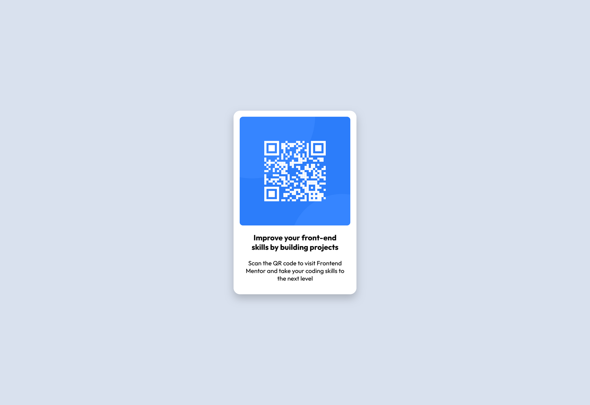

# Frontend Mentor - QR code component solution

This is a solution to the [QR code component challenge on Frontend Mentor](https://www.frontendmentor.io/challenges/qr-code-component-iux_sIO_H). Frontend Mentor challenges help you improve your coding skills by building realistic projects. 

## Table of contents

- [Overview](#overview)
  - [Screenshot](#screenshot)
  - [Links](#links)
- [My process](#my-process)
  - [Built with](#built-with)
  - [What I learned](#what-i-learned)
  - [Useful resources](#useful-resources)
- [Author](#author)

**Note: Delete this note and update the table of contents based on what sections you keep.**

## Overview

### Screenshot
|what i had to do|what i've done|
|----------------|--------------|
|||
|||

### Links

- Solution URL: [](https://your-solution-url.com)
- Live Site URL: [(hosted by vercel)](https://qr-code-component-main-neon-pi.vercel.app/)

## My process

### Built with

- Semantic HTML5 markup
- CSS custom properties
- Flexbox

### What I learned

i learned to import a font that i have locally in a folder
i learned some text features like the weight (that i didn' know what it means) and fallback fonts 
i learned one more time how to center a div

i'm pretty prud of this section of the stylesheet:

```css
@font-face {
    font-family: 'Outfit'; 
    src: url('./fonts/Outfit-VariableFont_wght.ttf') format('truetype');
}
```

### Useful resources

- [Example resource 1](https://www.example.com) - This helped me for XYZ reason. I really liked this pattern and will use it going forward.
- [Example resource 2](https://www.example.com) - This is an amazing article which helped me finally understand XYZ. I'd recommend it to anyone still learning this concept.

**Note: Delete this note and replace the list above with resources that helped you during the challenge. These could come in handy for anyone viewing your solution or for yourself when you look back on this project in the future.**

## Author

- Website - [bite](https://qr-code-component-main-neon-pi.vercel.app/)
- Frontend Mentor - [XbiteX](https://www.frontendmentor.io/profile/XbiteX)
